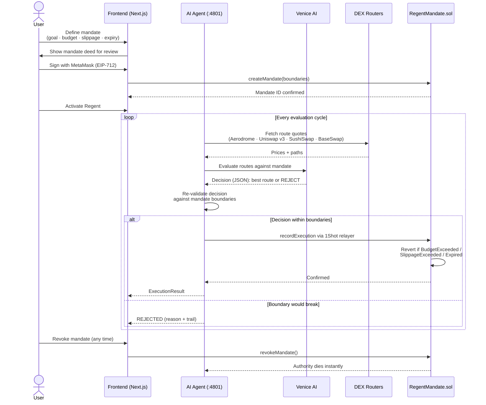
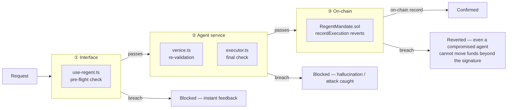
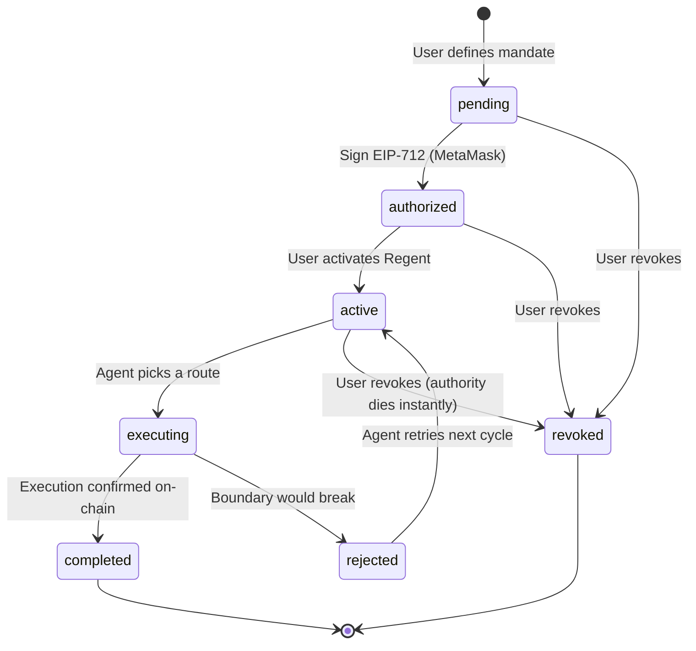

# Regent

> You give the mandate. Regent executes.

---

## The problem

DeFi is powerful but requires you to babysit it.

You spot an opportunity — swap ETH for USDC before slippage spikes, execute a DCA entry at the right price, rebalance before a deadline. But you're asleep. Or at work. Or you just don't want to watch a screen for six hours waiting for the right moment.

So you either miss it, or you hand your private key to an automation script and hope for the best. Both options are bad.

**Regent solves this without custody.**

You sign a bounded mandate — spend at most $500, accept no more than 1% slippage, expire in 24 hours — and an AI agent executes *within those exact limits*. The boundaries are enforced three independent times: in the interface, in the agent, and on-chain. No key ever leaves your wallet.

---

## How it works



---

## Trust model — why three layers

A single guard is a single point of failure. Regent enforces every boundary three independent times:



A bug or compromise in any one layer cannot move funds beyond the mandate.

---

## Mandate lifecycle



Every transition is appended to the audit log with a timestamp and source tag (`venice` / `heuristic` / `simulated`, `relayer` / `simulated`) — the trail is part of the product.

---

## Quick start

```bash
npm install

# terminal 1 — AI agent service (:4801)
npm run agent

# terminal 2 — web app (:3000)
npm run dev
```

Open [http://localhost:3000](http://localhost:3000). **No keys or testnet funds needed** — every layer falls back to simulation and labels it honestly in the UI.

The full flow: give a mandate → review the deed → authorize → activate Regent → watch it scan routes, reason, and execute within your limits — or refuse when a boundary would break.

---

## Structure

```
frontend/    Next.js 16 app — landing, dashboard, mandate flow, /api/agent proxy
ai-agent/    Agent service — Venice AI evaluation + 1Shot execution (Node 24, zero deps)
contract/    Foundry — RegentMandate.sol: on-chain budget/slippage/expiry guard (11 tests)
```

How they connect: [ARCHITECTURE.md](ARCHITECTURE.md). Roadmap: [TASKS.md](TASKS.md). Design system: [brand.md](brand.md).

---

## Going live

| Step | How |
|---|---|
| Venice AI decisions | `ai-agent/.env`: `VENICE_API_KEY=...` |
| Deploy the contract | `cd contract && PRIVATE_KEY=0x... ./script/deploy.sh` |
| On-chain mandates | `frontend/.env.local`: `NEXT_PUBLIC_MANDATE_CONTRACT=0x...` |
| 1Shot execution | `ai-agent/.env`: `EXECUTION_MODE=live`, `MANDATE_CONTRACT=0x...` |

```bash
npm run contract:test    # forge test — the mandate guard suite (11 tests)
npm run build            # production frontend build
```

---

## Hackathon tracks

- **Best Agent** — Regent *is* the agent: bounded delegation with an auditable decision trail
- **Best Use of Venice AI** — route evaluation and the decision engine (`ai-agent/src/venice.ts`)
- **Best Use of 1Shot Permissionless Relayer** — gas-abstracted delegated execution (`ai-agent/src/executor.ts`)
